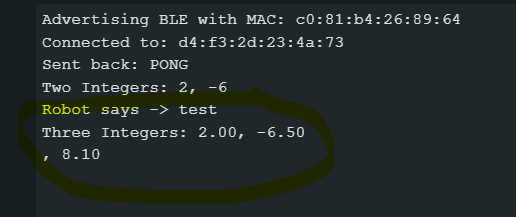
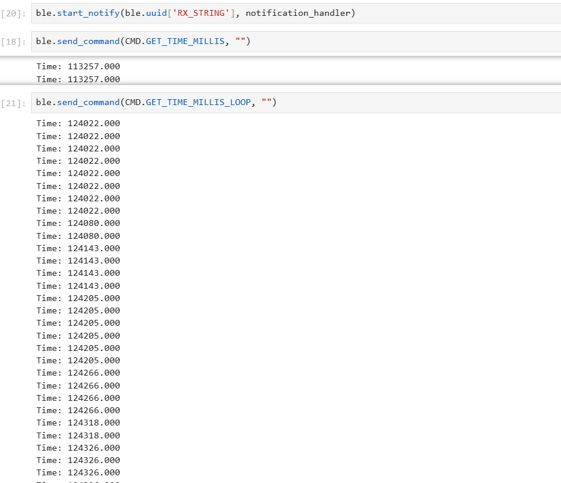
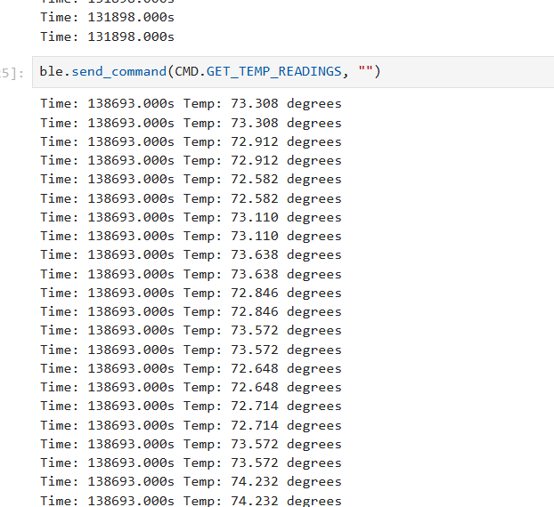
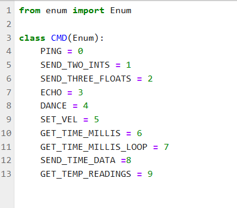

====================================
Lab 1: The Artemis Board and Bluetooth
====================================
 
.. contents::
    :depth: 2
    :local:

Overview
--------------------------------------------------------------------------
In this lab, we explored the SparkFun RedBoard Artemis Nano, focusing on its integration with the Arduino IDE and Bluetooth Low Energy (BLE) communication.

Lab 1A
--------------------------------------------------------------------------

Blink
^^^^^^^^^^^^^^^^^^^^^^^^^^^^^^^^^^^^^^^^^^^^^^^^^^^^^^^^^^^^^^^^^^^^^^^^^^

I started with the example "Blink" program to confirm that I could successfully program the board and control the on-board LED.

insert video

Serial
^^^^^^^^^^^^^^^^^^^^^^^^^^^^^^^^^^^^^^^^^^^^^^^^^^^^^^^^^^^^^^^^^^^^^^^^^^

After verifying basic programming functionality, I used the "Serial" example to test data communication between the board and a serial monitor, ensuring that input data was correctly echoed back.

insert video

Temperature & Microphone
^^^^^^^^^^^^^^^^^^^^^^^^^^^^^^^^^^^^^^^^^^^^^^^^^^^^^^^^^^^^^^^^^^^^^^^^^^

The "Analog Read" example demonstrated that sensor data, specifically from the temperature sensor, could be collected. Additionally, the "Microphone" example showed how I could access and process microphone data for frequency analysis.

insert video

Lab 1B
--------------------------------------------------------------------------

Prelab
^^^^^^^^^^^^^^^^^^^^^^^^^^^^^^^^^^^^^^^^^^^^^^^^^^^^^^^^^^^^^^^^^^^^^^^^^^

In this section, I focused on establishing Bluetooth Low Energy (BLE) communication with the Artemis board using the ArduinoBLE library. 
I interfaced with it using Python via the bleak module, which required setting up a virtual environment and installing the necessary packages:

.. code-block:: bash

   python3 -m venv FastRobots_ble
   .\FastRobots_ble\Scripts\activate
   pip install numpy pyyaml colorama nest_asyncio bleak jupyterlab

To enable BLE communication, I first identified the board’s unique MAC Address using the ble_arduino.ino sketch. 
This MAC Address was then updated in connections.yaml to establish a proper connection.

.. image:: images/connections.png
   :align: center
   :width: 50%
   :class: bottompadding image-border

Additionally, I generated a UUID for the Bluetooth service using Python:

.. code-block:: python

  from uuid import uuid4
  uuid4()

After updating both connections.yaml and ble_arduino.ino, I was able to establish a BLE connection using helper functions provided by the course libraries.
I had a lot of issues in this part and had to double check my python installations. Then I realized my bluetooth was not on :/. That solved my issues. 

Lab Tasks
^^^^^^^^^^^^^^^^^^^^^^^^^^^^^^^^^^^^^^^^^^^^^^^^^^^^^^^^^^^^^^^^^^^^^^^^^^

1. Echo
""""""""""""""""""""""""""""""""""""""""""""""""""""""""""""""""""""""""""

The ECHO command receives a string from Python, modifies it, and returns the altered string. The modified string is also printed via serial output and is kind of like an "echo". 

.. code-block:: c++
   :caption: Case Statement for ``ECHO``

   case ECHO:
 
            char char_arr[MAX_MSG_SIZE];

            // Extract the next value from the command string as a character array
            success = robot_cmd.get_next_value(char_arr);
            if (!success)
                return;

            const char* val; 

            //Serial.println("Robot says -> ", );
            tx_estring_value.clear();
            tx_estring_value.append(char_arr);
            val = tx_estring_value.c_str();
            tx_characteristic_string.writeValue(val);
            Serial.print("Robot says -> ");
            Serial.println(val);
            break;

See image below in section 2

2. Send Three Floats
""""""""""""""""""""""""""""""""""""""""""""""""""""""""""""""""""""""""""

The SEND_THREE_FLOATS command functions similarly to ECHO, but it processes three float arguments instead of a single string. 
The code I wrote was based on and partially copied from the example command SEND_TWO_INTS

.. code-block:: c++
   :caption: Case Statement for ``SEND_THREE_FLOATS``

        case SEND_THREE_FLOATS:
            float float_a, float_b, float_c;

            // Extract the next value from the command string as an integer
            success = robot_cmd.get_next_value(float_a);
            if (!success)
                return;

            // Extract the next value from the command string as an integer
            success = robot_cmd.get_next_value(float_b);
            if (!success)
                return;
            success = robot_cmd.get_next_value(float_c);
            if (!success)
                return;

            Serial.print("Three Integers: ");
            Serial.print(float_a);
            Serial.print(", ");
            Serial.println(float_b);
            Serial.print(", ");
            Serial.println(float_c);
            
            break;

.. image:: images/echoand3valtogether.png
   :align: center
   :width: 50%
   :class: bottompadding image-border

The photo above shows the inputs from the python side sending the commands. 
The photo below shows the serial monitor showing that it received the commands. 

3. Get Time Millis
""""""""""""""""""""""""""""""""""""""""""""""""""""""""""""""""""""""""""

The GET_TIME_MILLIS command returns the current time in the format T:123456, obtained using the millis() function. 

.. code-block:: c++
   :caption: Case Statement for ``GET_TIME_MILLIS`` 

        case GET_TIME_MILLIS:
        /*
          gets time
        */
            const char* time_val; 

            tx_estring_value.clear();
            tx_estring_value.append("Time: ");
            tx_estring_value.append((double)millis());
            time_val = tx_estring_value.c_str();
            tx_characteristic_string.writeValue(time_val);
            Serial.println(time_val);
            break;

See image below in section 5

4. Notification Handler
""""""""""""""""""""""""""""""""""""""""""""""""""""""""""""""""""""""""""

To parse the data being sent appropriately(and also follow lab instructions), I implemented a notification handler. I originally wrote much more complicated code, but then revised it after adding
steps 6 and 7 to be a little more simpler. 

.. code-block:: python
   :caption: Notification handler to record the time response
          incoming_val= [] 
          array_storage = []
          
          def notification_handler(uuid, byte_array): 
              global incoming_val, array_storage
              incoming_val.append(ble.bytearray_to_string(byte_array)[:])
              data = ble.bytearray_to_string(byte_array)
              array_storage.append(data)
              print(data)
        
         ble.start_notify(ble.uuid['RX_STRING'], notification_handler)
         
         # Send GET_TIME_MILLIS Command
         ble.send_command(CMD.GET_TIME_MILLIS, "")

5. GET_TIME_MILLIS_LOOP
""""""""""""""""""""""""""""""""""""""""""""""""""""""""""""""""""""""""""

THE GET_TIME_MILLIS_LOOP loops 
This can be used to measure differences in time.

.. code-block:: c++

  case GET_TIME_MILLIS_LOOP:
            double t;
            t = (double) millis();
            while ((double)millis() - t < 1000) {
                tx_estring_value.clear();
                tx_estring_value.append("Time: ");
                tx_estring_value.append((double)millis());
                tx_characteristic_string.writeValue(tx_estring_value.c_str());
             }
            break;

The photo above shows the commands GET_TIME_MILLIS_LOOP being executed.

6. SEND_TIME_DATA
""""""""""""""""""""""""""""""""""""""""""""""""""""""""""""""""""""""""""

I then wrote a command SEND_TIME_DATA that sent the time data back.

.. code-block:: c++
   :caption: Case Statements for  ``SEND_TIME_DATA``

      case SEND_TIME_DATA:
                float time_array[20];
                for (int i = 0; i < 20; i++) {
                      time_array[i] = (float)millis();
                  }
    
                for (int i = 0; i < 20; i++) {
                      tx_estring_value.clear();
                      tx_estring_value.append("Time: ");
                      tx_estring_value.append(time_array[i]);
                      tx_estring_value.append("s");
                      tx_characteristic_string.writeValue(tx_estring_value.c_str());
                  }
                break;

.. image:: images/sendtimedata.png
   :align: center
   :width: 50%
   :class: bottompadding image-border

The photo above shows the SEND_TIME_DATA command in action

7. GET_TEMP_READINGS
""""""""""""""""""""""""""""""""""""""""""""""""""""""""""""""""""""""""""

I wrote GET_TEMP_READINGS that records both time and temperature and can be easily parsed.

.. code-block:: c++
   :caption: Case Statements for ``GET_TEMP_READINGS`` 

   case GET_TEMP_READINGS:
              //setup code has been redacted for purposes of not posting unncessary code
            for (int i = 0; i < 20; i++) {
                  tx_estring_value.clear();
                  tx_estring_value.append("Time: ");
                  tx_estring_value.append(time_array1[i]);
                  tx_estring_value.append("s Temp: ");
                  tx_estring_value.append(temp_array[i]);
                  tx_estring_value.append(" degrees ");
                  tx_characteristic_string.writeValue(tx_estring_value.c_str());
            }
            break;

My notification handler broke when I added SEND_TEMP_DATA and GET_TEMP_READINGS, so I went back to reevaluate it as it was repeating weirdly. 
While I never figured out exactly what it was, I simplified it and redid it to print general statements.

The photo above shows the GET_TEMP_READINGS command in action

8. LAB QUESTION
""""""""""""""""""""""""""""""""""""""""""""""""""""""""""""""""""""""""""
I have two methods to collect and store data: incrementally using GET_TIME_MILLIS or in batches with the note and send data commands. Each approach has its own advantages and disadvantages. Using GET_TIME_MILLIS introduces significant delays between readings due to BLE communication, whereas recording data in batches runs in a loop on the Artemis, bypassing BLE latency and allowing for much faster iterations. With GET_TIME_MILLIS, I receive immediate feedback from sensors, which can be useful for debugging, while recording data in batches and sending it later introduces a delay between the initial request and data reception. In terms of storage, GET_TIME_MILLIS requires minimal, temporary storage to collect and send data immediately, but batch storage necessitates storing all data first, demanding significantly more memory. The approximate upper limit is 384kB of RAM; if I store only time (4B per reading), I can record up to 98,304 readings, while storing both time and temperature cuts this to 49,152 readings. If storage becomes a limitation, I may need to repeat batch recordings by overwriting previous data or reduce the sampling frequency to extend the data collection period.

Reflection
--------------------------------------------------------------------------

Communication is crucial in order to figure out what is happening. This lab seemed to be focused on getting settled with the board and establishing communication with it.
I struggled with getting set up only to realize that my bluetooth was not on.  It also took me embarassingly long to realize that I did not update my commands properly. 

Acknowledgements
--------------------------------------------------------------------------

Thanks to all the staff and the professor for helping in lab. I referenced the webpages of past students: Mikayla Lahr, Nidhi Sonwalkar, Kofi Ohene Adu, Minh Nguyen, and Daria Kot. 
I also had ChatGPT proof read this webpage and shorten my writing in areas where I was too wordy.
Shout out to Aidan McNay for sitting with me and teaching me about Sphinx and helping me build a test repo for this class(before I publish to this actual page)
